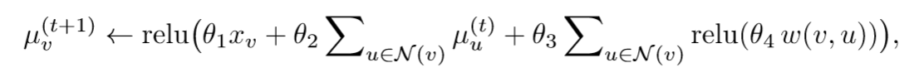
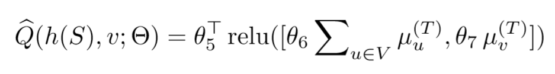
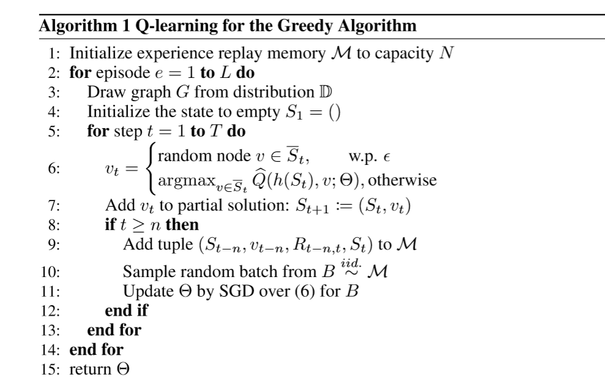
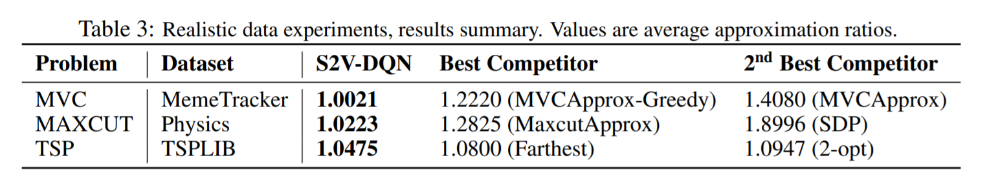
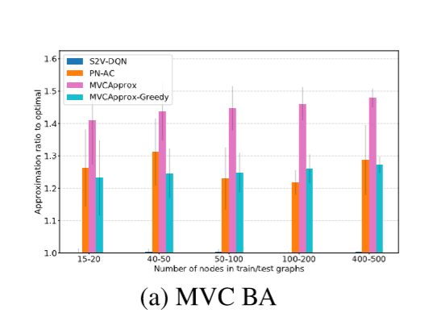
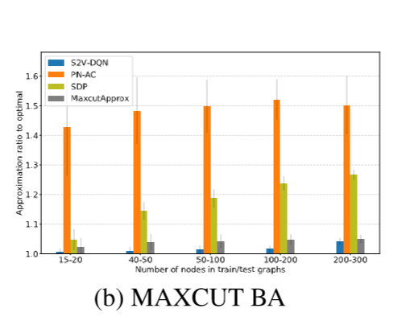
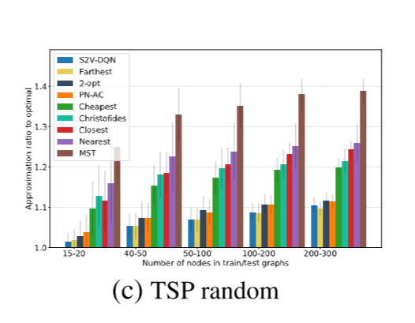

## Learning Combinatorial Optimization Algorithms over Graphs

Article summary 

Link : https://arxiv.org/pdf/1704.01665.pdf

---

### Problem: 

Approximate solution for NP-hard problems: 
 - Minimum vertex cover (MVC)
 - Maximum cut (MAXCUT) 
 - Travelling salesman problem: TSP

 ### What do we need to solve the problem?

 #### - Graph representation aka embeddings

 Authors use _structure2vec_. The main concept here is to make an embedding for each 
 graph vertex and encode there an information about vertex properties (e.g. color) 
 and "structure information" - the information about neighbors 
 (including information about their neighbors and properties)

 More formally:  We update vertex embedding depending on vertex properties `X_v`, embeddings of its neighbors , weights of its edges and model parameters. 

  The number of iterations for graph embedding is about 4.

#### - Partial solution (state)

Partial solution: an ordered list of vertexes added on previous iterations.

*State* is a sum of embeddings for all vertexes in current partial solution

`X_v`=0 if we haven't take the vertex to the solution and 1 if we have taken.

#### - Cost function

- MVC: -|S|
- MAXCUT: sum of edges weights in current cut
- TSP: The cost of a current tour

*Reward function* is a difference of cost functions between states

#### - Termination criterion

- MVC: all edges are covered
- MAXCUT: solution is not improved
- TSP:  S=V (there is an improvement of termination criterion as well)

#### - Helper function

State -> combinatorial structure of partial solution

#### - Algorithm to choose vertex to add (and place to add if applicable) (action) 

Evaluation function:  

##### Algorithm main points:

- Experience replay

- Reward is summed for previous n iterations

  

### Evaluation results

As a summary, this algorithm outperforms others in terms on approximation ratio to optimal.

In MVC it's very close to optimal.

The "optimal" value was calculated with solver time cutoff at 1 hour.

### More details on competing algorithms.

- Structure2Vec deep q-learning (described algorithm) **S2V-DQN**

- Pointer networks with actor-critic (based on RNNs) **PN-AC**

- **Approximate algorithms**

  - **MVC** (2-approximations)
    - *MVCApprox* - selects an uncovered edge and adds both of its endpoints
    - *MVCApprox-Greedy* - picks edge with maximum sum of degrees

  

  - **MAXCUT**

    - *MaxcutApprox* - moves the node to the other side. The node is selected to get the biggest improvement

    - *SDP* - randomized algorithm, 100 solutions are generated and the best is taken

      

      

  - **TSP**

    - Minimum spanning tree (MST)

    - Farthest/ Cheapest/ Closest insertion

      etc

      

      

